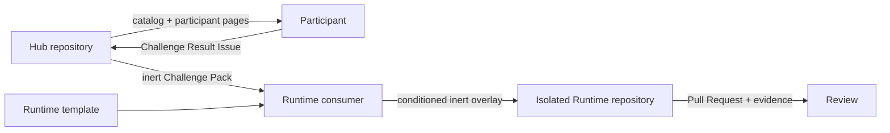

# Architecture

## Roles



- **Hub**: organizer/orchestrator、Challenge catalog、参加者向けページ、Pack配布、dry-run計画、提出集約。
- **Runtime template**: 各参加者が独立した実験リポジトリを作る土台。
- **Runtime consumer**: Packを検証し、選択conditionのpayloadを `.hackathon/challenge/**` へ不活性なままbyte copyする実装。
- **Participant Runtime**: code、active customization、実行、PR、Evidenceの置き場所。

GitHub App provisioningと実際のremote repository作成はこのFoundation PRの範囲外です。

## Catalog

`catalog/challenges.json` はHC-001からHC-045を順番に登録します。公開状態、表示title、track、support概要から、次の2ファイルだけを生成します。

- `docs/generated/challenge-index.md`
- `docs/generated/support-matrix.md`

Challengeの手順は各 `challenges/hc-xxx/README.md` がsource of truthです。Catalogの `sourceLab` は保守用の由来情報で、過去LABの完了を参加条件にしません。

公開対象は各entryの `status` から共通helperで導出し、ページ・directory・Pack・hash・手書きFormの選択肢を照合します。
`releasePlan` は運営者向けの固定制作・レビュー順だけで、公開状態を重複管理したり、参加者の前提やunlockに使ったりしません。
`sourceKind: baseline | synthetic` によって実baselineのexact pathと合成教材を区別します。
合成教材の `sourcePaths` は空配列ですが、Runtimeの固定baseline/provenanceは変わりません。
path-only inventoryと任意ガイドmetadataの詳細は [Contributing](../CONTRIBUTING.md) を参照してください。

実行対象のsource baselineは
`shinyay/code-to-doc-workshop-260910@398d7d1982a1402bcdba00d6c3ded67d8d338787`
です。`shinyay/github-copilot-customization-labs` のdocs/templatesと
`fixtures/tsubame-wholesale` はChallenge authoring referenceとして使いますが、同じcommitのprovenanceをLabsリポジトリへ誤帰属しません。

## Challenge Pack Contract v1

Pack directoryは次だけを含みます。

```text
pack/
├── manifest.json
└── payload/
    └── ...*.template
```

`schemas/challenge-pack.schema.json`、`fixtures/contracts/glob-conformance-v1.json`、
`fixtures/contracts/pack-hash-v1.json`
はRuntime v1との共有contract artifactです。期待bytesとSHA-256は
[`catalog/contract-artifacts.json`](../catalog/contract-artifacts.json)
で公開し、CIでbyte identityを検証します。

Manifestの必須field:

- `schemaVersion: 1`
- `challengeId`, `challengeVersion`
- `minimumTemplateVersion: 1`
- `conditions`
- `isolation`: tier、fresh workspace/conversation/profile/repository、condition strategy、branch safety
- `overlay`: inert source、`.hackathon/challenge/**` destination、適用conditions、`allowOverwrite: false`
- condition付きobjectの `allowedMutations`, `allowedAdditions`。`allowedMutations.expectedSha256` は変更前ではなく許可するpost-imageのSHA-256。
- `forbiddenActiveCustomizations`
- stage/condition付きobjectの `evidenceRequirements`、condition付きobjectの `submissionFiles`
- `cleanup`: baseline確認、submission export、process停止、repository archive

すべてのpathはrepository-relative POSIX形式です。absolute path、drive prefix、backslash、NUL、空segment、`.`、`..`、Windows予約名・無効文字、末尾dot/space、非NFC表現を拒否します。NFC化後のcase-insensitive collisionも拒否します。payload sourceは `payload/` 配下の `*.template` に限定し、Hubでは有効化しません。

## Overlay trust boundary

Runtime consumerはsourceとdestinationを検証し、sourceがPack内に存在すること、すべてのpayloadがmanifestから参照されること、destinationが `.hackathon/challenge/**` 内で未作成であることを確認してからbyte copyします。`allowOverwrite` はContract v1では常に `false` です。

active customizationはdefault-denyです。対象familyは `.github` のinstructions / agents / prompts / skills / hooks / plugins、`.copilot` のhooks / plugins、`.vscode/mcp.json`、`AGENTS.md`、`CLAUDE.md`、`.claude/**`、`.cursor/**` です。manifestの `forbiddenActiveCustomizations` はdenyを追加できますが、default denyを解除できません。参加者がactive artifactを作る場合は、選択conditionに対応する `allowedAdditions` へ明示します。`allowedAdditions` はRuntime所有の `.hackathon/**` と `submission/**` を対象にできません。Evidenceは `evidenceRequirements` に従うrun-stateです。

Hubのdry-run CLIは計画をJSONで返すだけで、filesystem overlay、GitHub API、remote作成、permission変更を行いません。
`core` は既存のPack計画、任意routeは `mode: "optional-guide"` の別出力です。
後者はページ・準備条件・既知blockを示すだけで、Pack、condition、grant、実行Evidenceの契約を持ちません。
ガイドがあることをRuntimeの実機サポートとみなしません。

## Deterministic Pack hash

Pack hashは `manifest.json` と全payloadを含む、path順にsortしたrecordからSHA-256で計算します。各recordのbyte列は次です。

```text
relativePath NUL 100644 NUL byteLength NUL fileSha256 LF
```

pathはUTF-8 byte列の `Buffer.compare` でsortします。`relativePath`、mode、数値、digestはUTF-8、`NUL` は1 byteの `0x00`、`LF` は `0x0a` です。timestamp、directory entry、OS path separatorはhashへ含めず、全fileをnon-executable `100644` として扱います。manifest自身へhashは埋め込みません。

```console
node scripts/build-pack.mjs --challenge HC-001 --output .runtime/packs
npm run hashes:check
```

出力Packはtemplatingせずpure byte-copyし、再hashがsourceと一致した場合だけsidecar `.sha256` を書きます。algorithm名は `pack-hash-v1`、公開期待値は `catalog/pack-hashes.json` で管理します。

## Glob and submission boundary

Contract v1 globはcase-sensitiveです。literal segment、1 segment内の `*`（leading dotにもmatch）、末尾の `/**`（1 segment以上）だけを許可します。`?`、brace、`!`、途中の `**` は拒否し、HubとRuntimeで同じconformance fixtureを実行します。

提出exportはdot-directory構造をmirrorせず、source pathのhashから衝突しないflatな不活性名を作ります。上限はPack 256 files / 10 MiB、overlay 128、Evidence 32 files（各1 MiB）、submission 64 files（各1 MiB、合計8 MiB）です。secret、credential、raw logを提出対象にしません。

Runtime exporterのbundleはRuntimeが検証します。Hubの
[`hub-result-draft.schema.json`](../schemas/hub-result-draft.schema.json) は非規範の将来集約草案であり、Runtime bundle schemaではありません。
Hubは現在、共通Issue FormとRuntime PRを提出入口とし、bundle取込APIや全体検証serviceを実装していません。

## Cleanup verification

Cleanup metadataはadvisory/manualです。dry-runは必要項目を表示しますが完了扱いにしません。確認状態は `pass`、`fail`、`blocked`、`not-observed` のいずれかで、初期値は必ず `not-observed` です。

`branchSafe: true` は `single-workspace` のときだけ許可します。`separate-workspace` または `separate-repository` のPackではfalseにし、Runtimeがcondition strategyを強制します。
